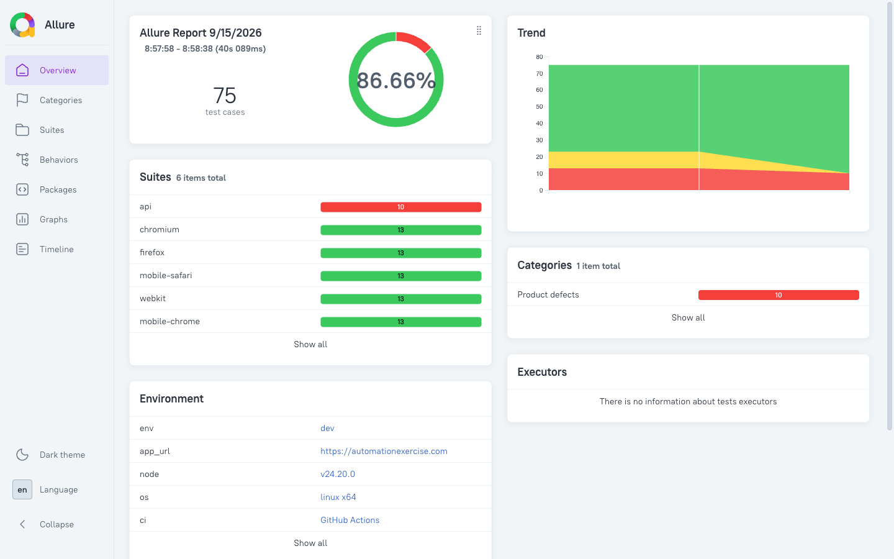

# Agentic Playwright Framework

A Playwright + TypeScript end-to-end suite for [automationexercise.com](https://automationexercise.com) - UI, API, and visual regression, page-object modelled, dependency-injected through fixtures. CI AI-diagnoses any failure, contract-verifies the report against what a consumer reads out of it, and publishes to a live Allure dashboard - all before a human ever needs to look.

[](https://github.com/pirasanthan-jesugeevegan/agentic-playwright-framework/actions/workflows/playwright.yml)

**Live Allure report:** https://pirasanthan-jesugeevegan.github.io/agentic-playwright-framework/

Every change here is written by an AI coding agent operating under a written constitution, through named roles, with a subset of the rules enforced mechanically before a write is even allowed to land - see [`CLAUDE.md`](./CLAUDE.md) for the full standard, the agent system, and the project structure.

## What it looks like



## Quick start

```bash
pnpm install
pnpm exec playwright install --with-deps

cp .env.example .env   # ENV=dev is the only environment with real URLs right now

pnpm test               # full suite, every project
pnpm test:smoke         # @smoke-tagged cases only
```

## Scripts

| Command                                              | Purpose                                                                       |
| ---------------------------------------------------- | ----------------------------------------------------------------------------- |
| `pnpm test`                                          | Run the full suite, every project                                             |
| `pnpm test:smoke`                                    | `@smoke`-tagged cases only                                                    |
| `pnpm test:ui` / `test:headed` / `test:debug`        | Interactive runs                                                              |
| `pnpm validate`                                      | lint + format:check + typecheck - all must be clean                           |
| `pnpm test:vr`                                       | Visual-regression project only                                                |
| `pnpm test:vr:update`                                | Regenerate VR baselines (Linux only - see the skill)                          |
| `pnpm test:scripts`                                  | Unit tests for the CI showcase pipeline (`scripts/`)                          |
| `pnpm check:status`                                  | Fails if `docs/STATUS.md` counts or caps drift from the real specs            |
| `pnpm test:agent-evals`                              | Checks the 5 agents still follow the constitution (needs `ANTHROPIC_API_KEY`) |
| `pnpm report:allure:generate` / `report:allure:open` | Build and view the Allure report locally                                      |

## How it's built

Every change goes through 5 named agent roles under one written constitution - see [`CLAUDE.md`](./CLAUDE.md#agent-system) for the full picture.

| Agent                       | Role                                                                |
| --------------------------- | ------------------------------------------------------------------- |
| `playwright-test-manager`   | Orchestrator - owns scope, the coverage cap, and the workflow cycle |
| `playwright-test-planner`   | Explores the live app via MCP, writes the plan before any code      |
| `playwright-test-generator` | Implements one case at a time from an existing plan                 |
| `playwright-test-reviewer`  | Read-only convention audit before a human commits                   |
| `playwright-test-healer`    | Root-causes a failing test or CI run before proposing any fix       |

A subset of the same rules is enforced mechanically (`.claude/scripts/enforce_constitution.py`), and `pnpm test:agent-evals` checks the agents' actual behavior against fixed scenarios drawn from their own instructions.

In CI, `scripts/qa-showcase/` closes two more loops after the suite runs: an AI diagnosis of any failure (`explain-failures.mjs`) is posted as a tracking GitHub issue and auto-closed once the suite is green again (`sync-ci-issue.mjs`), and the built report is verified against a consumer-driven contract (`verify-contract.mjs`) before it's allowed to publish.

## Suite coverage

Current test counts, what's implemented vs. planned, and findings against the application live
in [`docs/STATUS.md`](./docs/STATUS.md). Individual feature-area test plans (written before any
test code, per the workflow in `CLAUDE.md`) live under `docs/test-plans/`, `docs/api-test-plans/`,
and `docs/vr-test-plans/`.

## Tech stack

- Node.js + pnpm (`pnpm-lock.yaml` is the only lockfile)
- TypeScript, strict mode
- Playwright: chromium, firefox, webkit, mobile-chrome, mobile-safari, a dedicated no-browser `api` project, and a `visual-regression` project - fully parallel
- Allure reporting, published to GitHub Pages on every push to `main`/`master`
- `@anthropic-ai/sdk` for the CI failure-diagnosis pipeline and the agent eval harness
- ESLint + Prettier + Husky/lint-staged pre-commit
- Dependabot keeps npm and GitHub Actions dependencies current

## Contributing and license

See [`CONTRIBUTING.md`](./CONTRIBUTING.md) for setup and the rules a change is held to, and [`SECURITY.md`](./SECURITY.md) to report a vulnerability. Released under the [MIT License](./LICENSE).
